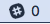

# Slack Status Menu for Mac

## About app
Slack Status Menu for Mac is display the number of Slack unread count on Mac status menu.

## Requirements
* Slack API token (at least permissions of channels:read, groups:read)
* Slack app on Mac App Store (optional)

## Usage
1. Launch SlackStatusMenu.app
2. Open setting window (in status menu)
3. Enter Slack API token and press OK (token per line)

## Menus
* Slack - Launch Slack app (if installed)
* Setting - Show Slack API token setting window
* Quit - Quit this app

## License
Licensed under the MIT License.

## Others
* This app is not created by Slack Technologies, Inc, nor related to it.
